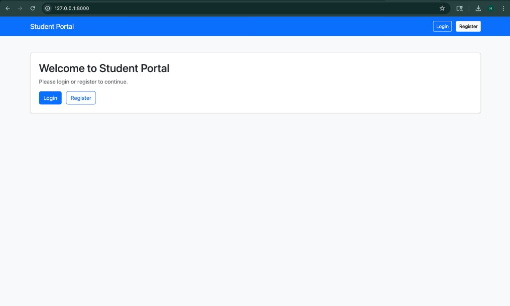
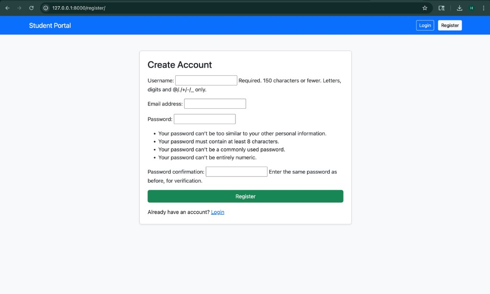
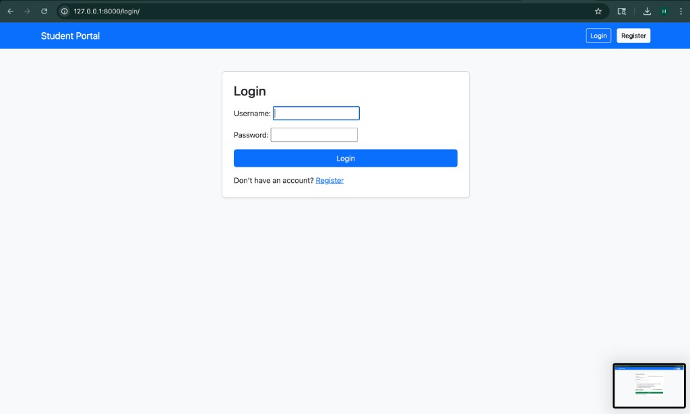

# Django Assignment Documentation

## Student Information
- Name: `Harsh Jain`
- Roll Number: `62`
- GitHub ID: `harshj13`
- Repository: [https://github.com/harshj13/django-project](https://github.com/harshj13/django-project)

## Project Title
Student Portal - Django Authentication System

## Objective
Create a Django web project using Bootstrap templates with user authentication (register, login, logout), SQLite3 database, and upload the complete project to GitHub.

## Technology Used
- Python 3
- Django
- SQLite3
- Bootstrap 5 (CDN)
- Git and GitHub

## Features Implemented
- Home page with Bootstrap UI
- User registration page
- User login page
- User logout functionality
- SQLite3 database integration
- GitHub repository upload

## Step-by-Step Project Setup
1. Open terminal and move to project folder:
   ```bash
   cd "/Users/harshjain/Downloads/django assingment 3"
   ```
2. Create and activate virtual environment:
   ```bash
   python3 -m venv .venv
   source .venv/bin/activate
   ```
3. Install dependencies:
   ```bash
   pip install -r requirements.txt
   ```
4. Apply migrations:
   ```bash
   python manage.py migrate
   ```
5. Run development server:
   ```bash
   python manage.py runserver
   ```
6. Open in browser:
   - `http://127.0.0.1:8000/` (Home)
   - `http://127.0.0.1:8000/register/` (Register)
   - `http://127.0.0.1:8000/login/` (Login)

## GitHub Upload Steps
1. Initialize git and commit:
   ```bash
   git init
   git add .
   git commit -m "Initial Django assignment project with authentication"
   ```
2. Create GitHub repository and push:
   ```bash
   gh repo create harshj13/django-project --public --source . --remote origin --push
   ```

## Output Screenshots

### 1) Home Page


### 2) Register Page


### 3) Login Page


## Project Output Summary
- Django project runs successfully on localhost.
- Authentication pages are working.
- Bootstrap styling is applied.
- Project is uploaded to GitHub successfully.

